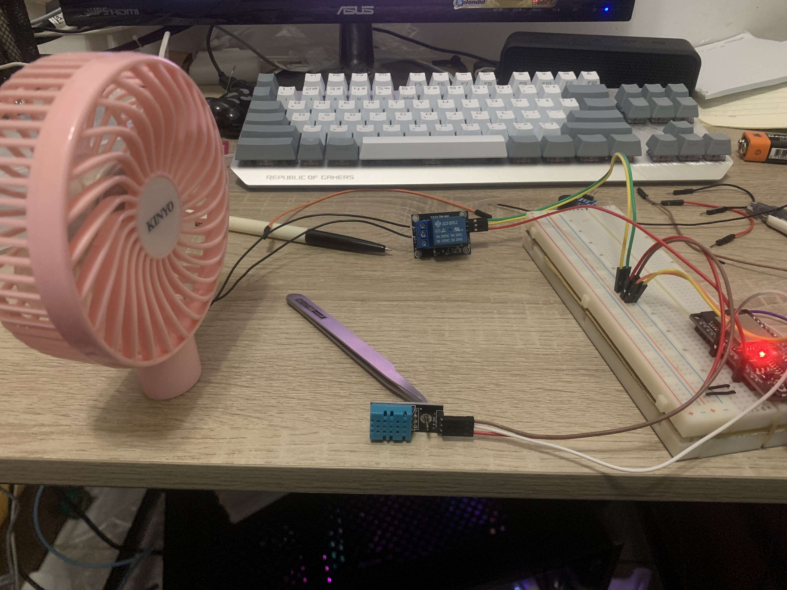

# 散熱系統

## 材料
1. ESP32
1. 溫溼度感測
1. LED(紅:太熱；綠: 正常)
1. OLED
1. 電扇

## 技術
- Arduino IDE
- Wifi Webserver 

## 函式庫
- DHT Sensor Library
- LiquidCrystal_I2C

## 主要功能:
- 系統啟動後，實時偵測環境溫溼度變化，並顯示數據於OLED螢幕。
- 偵測到溫度在設定正常值內則亮綠燈；若偵測到溫度過高亮紅燈，並啟動電扇進行降溫
- 可連上WiFi，在網頁上即時顯示溫度及濕度，風扇是否啟動，也可手動開啟或關閉風扇，實現遠端遙測及控制。

