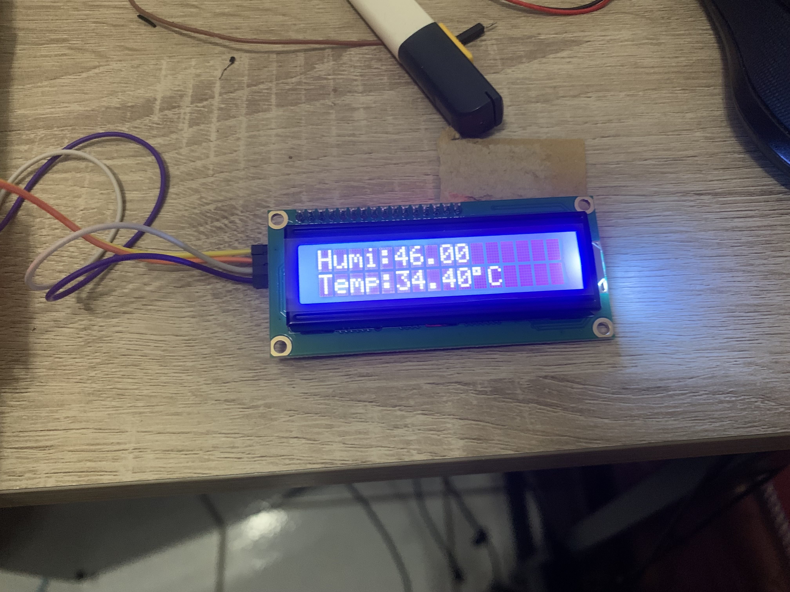

# ESP32 智慧散熱監控系統

## 專題背景

我設定了一個使用情景，實驗室的電腦長時間運作時溫度偏高，我想做一個能自動偵測並主動降溫的裝置，
順便練習 ESP32 的 Wi-Fi 功能，讓監控不只侷限在本地端。

這是我第一個從電路設計、韌體撰寫到前端顯示全部獨力完成的 IoT 專案。

---

## 硬體材料

| 元件 | 型號 / 說明 |
|------|------------|
| 核心控制器 | ESP32 DevKit V4 |
| 溫溼度感測 | DHT22 |
| 顯示模組 | I2C 1602 LCD |
| 狀態指示 | 紅色 LED（過熱）/ 綠色 LED（正常） |
| 動力元件 | USB 風扇（模擬器以藍色 LED 替代） |

---

## 使用技術

- **開發環境**：Arduino IDE（實體燒錄）、Wokwi（線上模擬）
- **通訊**：Wi-Fi HTTP WebServer
- **函式庫**：`WiFi.h` / `WebServer.h` / `DHT.h` / `LiquidCrystal_I2C.h`

---

## 功能說明

**溫控邏輯**

- 溫度正常 → 綠燈
- 溫度超過 45°C → 紅燈 + 自動啟動風扇

**遠端監控（Wi-Fi）**

- 連上同一網路後可透過瀏覽器查看即時溫溼度
- 支援手動強制開啟／關閉風扇，或切回自動模式

---

## 開發過程中遇到的問題

**DHT22 讀值不穩定**
初期發現每隔幾秒會出現一次讀值異常（回傳 `nan`），
查閱資料後發現是拉電阻未接好，加上 4.7kΩ 上拉電阻後穩定。

**Wokwi 模擬與實體行為不一致**
模擬器中風扇邏輯正常，燒錄到實體後觸發時機有落差，
最後發現是 `delay()` 影響了 WebServer 的回應，
改用 `millis()` 做非阻塞式計時後解決。

---

## 專案展示

### 系統實體

### LCD 即時顯示

### Wokwi 模擬畫面

### 網頁監控介面

---

## 未來展望

- [ ] 加入溫度歷史紀錄（用 SPIFFS 或外接 SD 卡）
- [ ] WebSocket 取代輪詢，讓網頁數據更新更即時
- [ ] 加入 OLED 替換現有 LCD，顯示更多資訊